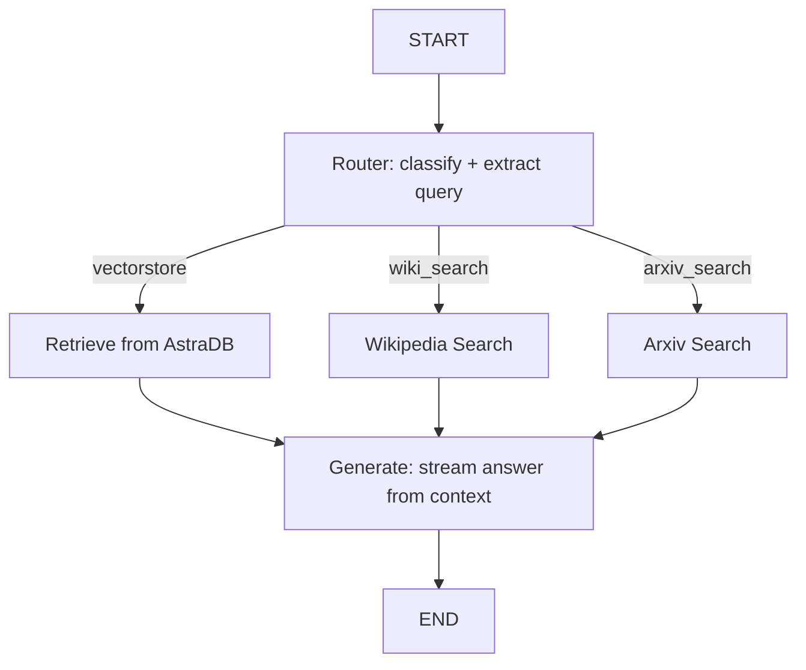

# Intelligent Query Router

An agentic RAG system built with LangGraph that classifies each incoming question and dynamically routes it to the most relevant data source — a private AstraDB vectorstore, Wikipedia, or arXiv — before generating a grounded, streamed answer.

**GitHub Repository:**  
https://github.com/pranayprasad7001/generative-ai-projects/tree/main/langchain-projects/intelligent-query-router

---

## Overview

Instead of always retrieving from one fixed knowledge base, this project makes a routing decision per question. A structured-output LLM call (a Pydantic schema, not string parsing) decides whether to:

- Search a private **vectorstore** of ingested documents (currently three of Lilian Weng's blog posts, covering agent harnesses, reasoning, and adversarial attacks on LLMs)
- Search **Wikipedia** for general knowledge questions
- Search **arXiv** for research-paper-specific questions

The router also extracts clean search keywords from the question, stripping conversational filler, and wraps exact paper titles in quotes to force a phrase-level search on arXiv.

Everything is orchestrated as a LangGraph `StateGraph`, with per-session conversation memory and the final answer streamed token-by-token to the terminal.

---

## How It Works



1. The user submits a question through the CLI chat loop.
2. `router_node` calls an LLM constrained to a `RouteQuery` Pydantic schema, returning a `datasource` (`vectorstore` / `wiki_search` / `arxiv_search`) and a cleaned search query.
3. `route_question` sends the state to the matching node:
   - `retrieve` pulls the top-3 similar chunks from the AstraDB vectorstore.
   - `wiki_search` / `arxiv_search` call the respective LangChain tool wrappers.
4. `generate` builds a context-grounded prompt from whatever documents were returned and streams the LLM's response token-by-token to stdout.
5. An `InMemorySaver` checkpointer, keyed by a per-session `thread_id`, keeps conversation state across turns of the CLI loop.

---

## Features

- Structured-output query routing (Pydantic schema) with keyword extraction and exact-phrase quoting for paper titles
- Three-way retrieval — private vectorstore (RAG), Wikipedia, and arXiv — selected dynamically per question
- Idempotent document ingestion: vectorstore inserts use MD5 hashes of `source + content` as deterministic IDs, so re-running ingestion never creates duplicate embeddings
- LangGraph `StateGraph` orchestration with conditional edges based on the router's decision
- Per-session conversation memory via LangGraph's `InMemorySaver` checkpointer and a UUID `thread_id`
- Token-by-token streaming of the final answer
- Optional LangSmith tracing, toggled via environment variables

---

## Tech Stack

- **Language:** Python 3.13
- **Orchestration:** LangGraph (StateGraph, conditional edges, checkpointing)
- **LLM Framework:** LangChain (core, community, classic)
- **LLM:** Groq (`openai/gpt-oss-120b`)
- **Embeddings:** Hugging Face `sentence-transformers/all-MiniLM-L6-v2`
- **Vector Store:** AstraDB (DataStax)
- **External Tools:** Wikipedia API and arXiv API, via LangChain community tool wrappers
- **Observability:** LangSmith (optional)
- **Dependency Management:** uv (`pyproject.toml` + `uv.lock`)

---

## Project Structure

```
intelligent-query-router/
│
├── main.py              # Entry point — wires everything together, runs the CLI chat loop
├── graph.py             # LangGraph StateGraph: nodes, conditional routing edges, checkpointing
├── model_init.py        # Initializes the LLM, embedding model, and AstraDB vector store
├── preprocess_docs.py   # Loads & chunks source URLs, embeds with idempotent hashed IDs
├── query_router.py      # Pydantic RouteQuery schema + structured-output routing chain
├── tool_call.py         # Initializes the Wikipedia and arXiv LangChain tools
├── requirements.txt     # Pip-installable dependency list
├── pyproject.toml       # Project metadata & dependencies (uv)
├── uv.lock              # Locked dependency versions
└── README.md
```

---

## Installation

Clone the repository:
```bash
git clone https://github.com/pranayprasad7001/generative-ai-projects.git
```

Navigate to the project folder:
```bash
cd generative-ai-projects/langchain-projects/intelligent-query-router
```

Install dependencies with `uv` (recommended, since a lockfile is included):
```bash
uv sync
```

Or with pip:
```bash
pip install -r requirements.txt
```

---

## Environment Variables

Create a `.env` file in the project root:

```
ASTRA_DB_API_KEY=your_astra_db_api_key
ASTRA_DB_ENDPOINT=your_astra_db_endpoint
HUGGINGFACEHUB_API_TOKEN=your_huggingface_token
GROQ_API_KEY=your_groq_api_key

# Optional — LangSmith tracing
LANGSMITH_TRACING=false
LANGSMITH_API_KEY=
LANGSMITH_PROJECT=
```

---

## Usage

Run the chat loop:
```bash
python main.py
```

On first run, it embeds the URLs configured in `main.py` into the AstraDB vectorstore (safe to re-run — ingestion is idempotent), then starts an interactive session:

```
==================================================
Welcome to Agent Chat! Type 'exit', 'quit', or 'q' to end.
==================================================

User: What is agentic harness design?
---ROUTING QUESTION---
---ROUTING TO VECTORSTORE---
---RETRIEVE FROM VECTORSTORE---
---GENERATE ANSWER---

Answer: ...
```

Type `exit`, `quit`, or `q` to end the session.

---

## Notes & Limitations

- Conversation memory uses LangGraph's `InMemorySaver`, so history resets on restart — it isn't persisted to disk or a database.
- The vectorstore is seeded from a small, hardcoded list of URLs in `main.py`; adding new sources means editing that list directly (no ingestion CLI/UI yet).
- No automated test suite or evaluation harness yet — see the guardrails & evals roadmap in the parent repo's [README](../../README.md).
- CLI-only for now; no deployed demo.

---

## Future Improvements

- Config-driven ingestion (URLs/files via a config file or CLI flag instead of hardcoding)
- Persistent checkpointing (e.g. SQLite/Postgres saver) instead of in-memory
- Source citations in generated answers
- A lightweight UI (Streamlit) for non-CLI interaction
- Retrieval-quality and routing-accuracy evaluation tests

---

## License

This project is part of the [generative-ai-projects](https://github.com/pranayprasad7001/generative-ai-projects) repository and is licensed under the MIT License. See the root [LICENSE](../../LICENSE) file for details.
